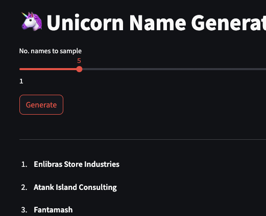

# unicorn-namegen



I built a character-level language model to generate startup names.

You can play with the demo here: https://huggingface.co/spaces/hardik-vala/namegen-1. (Be patient, HF's inference stack is slow...)

This is a fun side-project I've been hacking on to,
1) Learn Pytorch (I've grown up in TF-land)
2) Brush-up on my NN fundamentals
3) See if I can address a gap in existing LLMs, which are trained on coarse tokens, limiting them to "portmanteau"-style generations when prompted for names. 

This is a premature release. There are still many quality improvements to be made (I also want to add text-to-name support). You'll notice that many of the generated samples are "off-by-one" (if you fixed 1-2 characters, the name would look right), which might suggest under-training. But I did train to convergence so I believe the root problem is lack of training data.

Here are some fairly good outputs:

```
*CineDiagnostics* (Advanced diagnostic technology for cinematography?)

*Sound* (Good luck getting that .com domain)

*Swaffer* 

*Newbase*

*Valleym* (Accidentally clever)
```

And for the sake of symmetry, here are some bad outputs:

```
*Youtne Media Products Opportunities Series - Industries Innovations* (sounds like an offshore shell company)

*Venturelcom* (so close)

*Firstades Rybert* (gazuntite)

*Wrendcomputhelecam* (someone call an ambulance)

*Blot Stall Charly Nangua* (if I ever join the air force, this will be my call sign)
```

Note: I authored the sarcastic comments -- the model isn't that clever (yet).

I believe the most effective usage mode is not as a slot machine (ie. sampling names until you get one you like), but as an inspiration generator.

ToS: I'm not liable if this model spits out a name that infringes on a trademark.

## Stats for nerds

Dataset:
* 101,318 company names, drawn from YC startups, SEC records, Canada's Open Database of Businesses, and GoDaddy's expiring domain auction
* Length of dataset in characters: 1,602,673
* Vocabulary size: 90 (originally 73, but used a custom BPE tokenizer to bump it up to 90, which improved performance)
* Final dataset consisted of 1,297,835 training tokens (95%) and 68,323 validation tokens (5%)

Model: 
* Decoder only (I want to train an encoder as well to support text-to-name functionality)
* 7 transformer blocks with 6 self-attention heads each
* Context window: 20 tokens
* Embedding dim.: 84

Training:
* Optimizer: AdamW
* Training time: ~47 min.
* GPU: Single T4
* Trained to convergence

Source code available here: https://github.com/hardik-vala/unicorn-namegen.